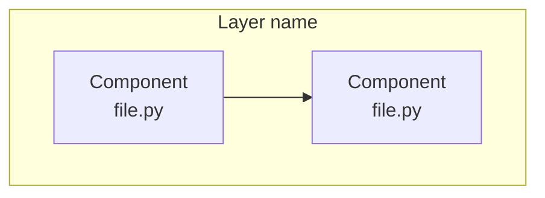
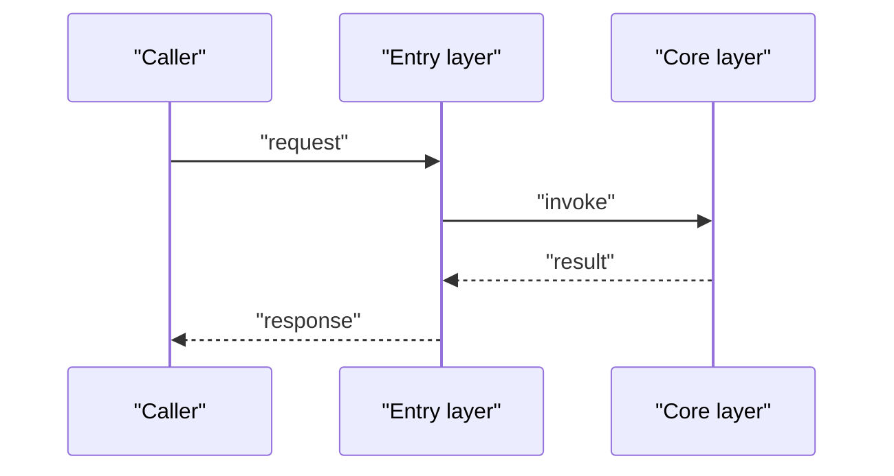
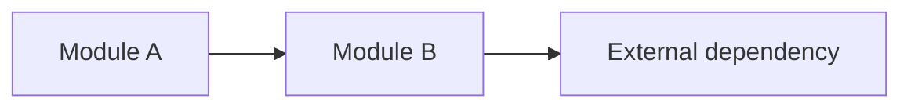

# {{TITLE}}

## Contents
1. [Introduction](#introduction)
2. [Project Structure](#project-structure)
3. [Core Components](#core-components)
4. [Architecture Overview](#architecture-overview)
5. [Detailed Component Analysis](#detailed-component-analysis)
6. [Dependency Analysis](#dependency-analysis)
7. [Performance and Consistency Considerations](#performance-and-consistency-considerations)
8. [Troubleshooting Guide](#troubleshooting-guide)
9. [Conclusion](#conclusion)

## Introduction
<One paragraph: what this page's topic is, what problem it solves, where it lives in the repository.>

## Project Structure
<Repository directories/files relevant to this chapter (bullet list, plain-text paths).>

Diagram sources
- [<path>:<start>-<end>](file://<path>#L<start>-L<end>)

Section sources
- [<path>:<start>-<end>](file://<path>#L<start>-L<end>)

## Core Components
- <component/concept name>: <one-sentence responsibility>

Section sources
- [<path>:<start>-<end>](file://<path>#L<start>-L<end>)

## Architecture Overview
<One paragraph + a sequence diagram describing the runtime interaction or data flow of this topic.>

Diagram sources
- [<path>:<start>-<end>](file://<path>#L<start>-L<end>)

Section sources
- [<path>:<start>-<end>](file://<path>#L<start>-L<end>)

## Detailed Component Analysis
### <sub-component / sub-topic 1>
- Responsibility: <...>
- Key behaviors: <...>
- Implementation notes: <...>

Section sources
- [<path>:<start>-<end>](file://<path>#L<start>-L<end>)

### <sub-component / sub-topic 2>
- ...

Section sources
- [<path>:<start>-<end>](file://<path>#L<start>-L<end>)

## Dependency Analysis
- <upstream/downstream dependencies (bullet list).>

Diagram sources
- [<path>:<start>-<end>](file://<path>#L<start>-L<end>)

Section sources
- [<path>:<start>-<end>](file://<path>#L<start>-L<end>)

## Performance and Consistency Considerations
- <performance characteristics, concurrency, caching, consistency trade-offs (bullet list).>

Section sources
- [<path>:<start>-<end>](file://<path>#L<start>-L<end>)

## Troubleshooting Guide
- <common error/symptom → cause → how to locate → relevant code location.>

Section sources
- [<path>:<start>-<end>](file://<path>#L<start>-L<end>)

## Conclusion
<One paragraph: the topic's positioning, correct usage, and caveats.>

Section sources
- [<path>:<start>-<end>](file://<path>#L<start>-L<end>)

<cite>
**Files referenced by this page**
- [<file name>](file://<repo-relative path>)
- [<file name>](file://<repo-relative path>)
</cite>
