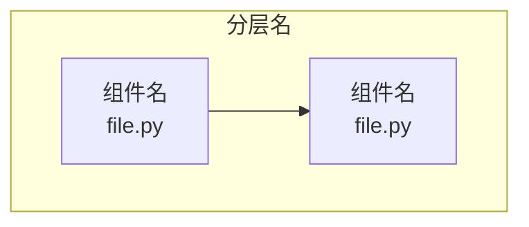
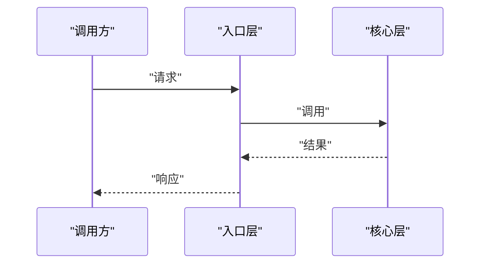
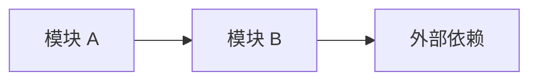

# {{TITLE}}

## 目录
1. [简介](#简介)
2. [项目结构](#项目结构)
3. [核心组件](#核心组件)
4. [架构总览](#架构总览)
5. [详细组件分析](#详细组件分析)
6. [依赖关系分析](#依赖关系分析)
7. [性能与一致性考量](#性能与一致性考量)
8. [故障排查指南](#故障排查指南)
9. [结论](#结论)

## 简介
<一段话概括本页主题：是什么、解决什么问题、在仓库中的位置。>

## 项目结构
<与本章相关的仓库目录/文件组织说明（bullet 列表，路径用纯文本）。>

图表来源
- [<path>:<起>-<止>](file://<path>#L<起>-L<止>)

章节来源
- [<path>:<起>-<止>](file://<path>#L<起>-L<止>)

## 核心组件
- <组件/概念名>：<一句话职责说明>

章节来源
- [<path>:<起>-<止>](file://<path>#L<起>-L<止>)

## 架构总览
<一段话 + 时序图，描述本主题的运行时交互或数据流。>

图表来源
- [<path>:<起>-<止>](file://<path>#L<起>-L<止>)

章节来源
- [<path>:<起>-<止>](file://<path>#L<起>-L<止>)

## 详细组件分析
### <子组件/子主题 1>
- 职责：<...>
- 关键行为：<...>
- 实现要点：<...>

章节来源
- [<path>:<起>-<止>](file://<path>#L<起>-L<止>)

### <子组件/子主题 2>
- ...

**章节来源**
- [<path>:<起>-<止>](file://<path>#L<起>-L<止>)

## 依赖关系分析
- <上游/下游依赖说明（bullet 列表）。>

图表来源
- [<path>:<起>-<止>](file://<path>#L<起>-L<止>)

章节来源
- [<path>:<起>-<止>](file://<path>#L<起>-L<止>)

## 性能与一致性考量
- <性能特征、并发、缓存、一致性取舍等要点（bullet 列表）。>

章节来源
- [<path>:<起>-<止>](file://<path>#L<起>-L<止>)

## 故障排查指南
- <常见错误/现象 → 原因 → 定位步骤 → 相关代码位置。>

章节来源
- [<path>:<起>-<止>](file://<path>#L<起>-L<止>)

## 结论
<一段话总结：本主题的定位、正确使用方式与注意事项。>

章节来源
- [<path>:<起>-<止>](file://<path>#L<起>-L<止>)

<cite>
**本文引用的文件**
- [<文件名>](file://<仓库相对路径>)
- [<文件名>](file://<仓库相对路径>)
</cite>
